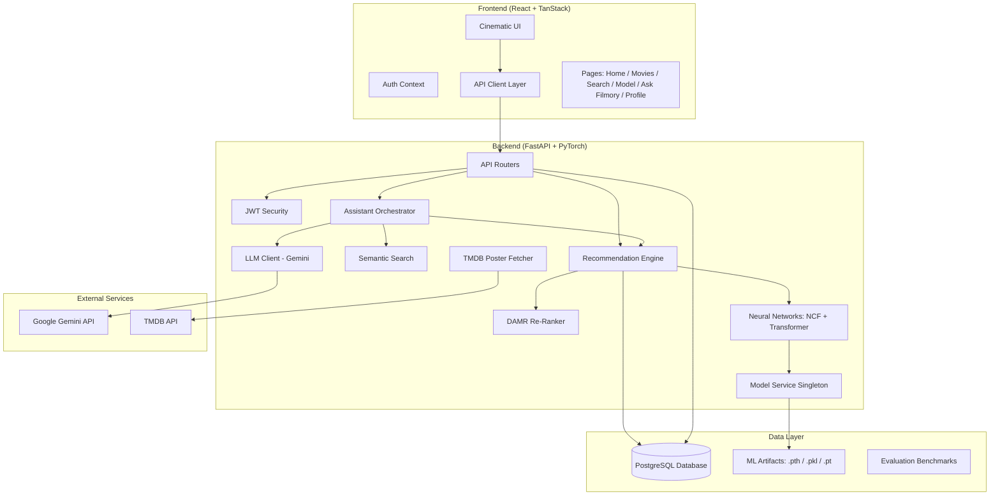

# Filmory — Complete Project Walkthrough

> **Filmory** is a full-stack AI-powered movie recommendation platform that fuses three trained neural-network experts with a novel drift-aware re-ranking algorithm (DAMR), and layers a conversational GenAI assistant on top — all served through a cinematic React frontend.

---

## Table of Contents

1. [System Architecture Overview](#1-system-architecture-overview)
2. [Technology Stack](#2-technology-stack)
3. [Project Directory Structure](#3-project-directory-structure)
4. [Backend — Configuration](#4-backend--configuration)
5. [Backend — Database Layer](#5-backend--database-layer)
6. [Backend — Database Models (ORM)](#6-backend--database-models-orm)
7. [Backend — Security & Authentication](#7-backend--security--authentication)
8. [Backend — ML Neural Network Architectures](#8-backend--ml-neural-network-architectures)
9. [Backend — Model Service (Singleton Loader)](#9-backend--model-service-singleton-loader)
10. [Backend — Trained Model Artifacts](#10-backend--trained-model-artifacts)
11. [Backend — Recommendation Engine](#11-backend--recommendation-engine)
12. [Backend — DAMR: Drift-Aware Momentum Re-Ranker](#12-backend--damr-drift-aware-momentum-re-ranker)
13. [Backend — TMDB Poster Integration](#13-backend--tmdb-poster-integration)
14. [Backend — Ask Filmory: Conversational Assistant](#14-backend--ask-filmory-conversational-assistant)
15. [Backend — LLM Client (Gemini Integration)](#15-backend--llm-client-gemini-integration)
16. [Backend — Semantic Search Service](#16-backend--semantic-search-service)
17. [Backend — API Routers (REST Endpoints)](#17-backend--api-routers-rest-endpoints)
18. [Backend — Pydantic Schemas](#18-backend--pydantic-schemas)
19. [Backend — Evaluation & Benchmarking](#19-backend--evaluation--benchmarking)
20. [Backend — Test Suite](#20-backend--test-suite)
21. [Frontend — Architecture & Routing](#21-frontend--architecture--routing)
22. [Frontend — Pages (Routes)](#22-frontend--pages-routes)
23. [Frontend — Components](#23-frontend--components)
24. [Frontend — API Layer & State Management](#24-frontend--api-layer--state-management)
25. [Frontend — Types & Interfaces](#25-frontend--types--interfaces)
26. [Data Pipeline & Offline Training](#26-data-pipeline--offline-training)
27. [Offline Evaluation Metrics](#27-offline-evaluation-metrics)
28. [Live Assistant Evaluation Results](#28-live-assistant-evaluation-results)
29. [How to Run the Project](#29-how-to-run-the-project)
30. [Key Design Decisions & Novel Contributions](#30-key-design-decisions--novel-contributions)

---

## 1. System Architecture Overview



**Data flow for a recommendation request:**
1. User opens the home page → frontend calls `GET /api/recommendations/me?variant=damr`
2. FastAPI router authenticates via JWT → resolves user
3. Recommendation engine runs the 4-stage pipeline:
   - **Stage 1**: NCF Hybrid scores all ~22,836 candidate items → selects top 100
   - **Stage 2**: Sequential Transformer scores those 100 candidates
   - **Stage 3**: Genre affinity scores based on user's live genre profile
   - **Stage 4**: DAMR re-ranks using drift-adaptive weights, momentum, quality, diversity
4. Top 10 results returned with full score transparency (NCF, Transformer, Genre, Momentum, Agreement, Quality, Diversity scores)
5. Frontend renders movie cards with poster images (lazy-fetched from TMDB)

---

## 2. Technology Stack

### Backend
| Layer | Technology |
|---|---|
| **Framework** | FastAPI ≥0.115 with Uvicorn ASGI server |
| **Language** | Python 3.13 |
| **Deep Learning** | PyTorch ≥2.0 (NCF + Transformer models) |
| **Database** | PostgreSQL with SQLAlchemy 2.0 ORM + Alembic migrations |
| **Auth** | JWT (python-jose) with bcrypt password hashing (passlib) |
| **GenAI** | Google Gemini API (`google-genai` SDK) — `gemini-3.6-flash` |
| **Validation** | Pydantic v2 with pydantic-settings |
| **Testing** | pytest with acceptance + unit + DAMR ablation tests |

### Frontend
| Layer | Technology |
|---|---|
| **Framework** | React 19 + TypeScript |
| **Bundler** | Vite |
| **Routing** | TanStack Router (file-based) |
| **Data Fetching** | TanStack React Query |
| **UI Components** | Radix UI primitives + shadcn/ui |
| **Styling** | Tailwind CSS 4 |
| **Icons** | Lucide React |
| **Notifications** | Sonner toast library |

### Data
| Source | Details |
|---|---|
| **MovieLens 25M** | 25 million ratings, 62,423 movies, 162,541 users |
| **Catalog** | 22,836 movies with genres, years, ratings, descriptions |
| **TMDB** | Real-time poster/backdrop URLs via TMDB API |
| **Gemini Embeddings** | `text-embedding-004` for semantic movie search |

---

## 3. Project Directory Structure

```
Filmory/
├── README.md                          # Project overview
├── docs/
│   └── DAMR.md                        # DAMR research documentation
│
├── backend/
│   ├── .env                           # Environment variables (DB, API keys)
│   ├── requirements.txt               # Python dependencies
│   ├── alembic.ini                    # Database migration config
│   │
│   ├── app/                           # Main application package
│   │   ├── main.py                    # FastAPI app entry point + lifespan
│   │   ├── config.py                  # All settings (ML params, DAMR, GenAI)
│   │   ├── database.py                # SQLAlchemy engine + session factory
│   │   │
│   │   ├── core/                      # Security & dependency injection
│   │   │   ├── security.py            # JWT creation, password hashing
│   │   │   └── deps.py                # FastAPI dependencies (get_current_user)
│   │   │
│   │   ├── models/                    # SQLAlchemy ORM models
│   │   │   └── db_models.py           # 10 tables: User, Movie, Interaction, etc.
│   │   │
│   │   ├── schemas/                   # Pydantic request/response schemas
│   │   │   ├── schemas.py             # Core schemas (Movie, User, Auth, etc.)
│   │   │   └── assistant.py           # Assistant schemas (Intent, Chat, Evidence)
│   │   │
│   │   ├── routers/                   # FastAPI API endpoint routers
│   │   │   ├── auth.py                # POST /register, /login, /demo, GET /me
│   │   │   ├── movies.py              # GET /movies, /genres, /movies/:id
│   │   │   ├── recommendations.py     # GET /recommendations, /similar, /trending
│   │   │   ├── interactions.py        # POST /interactions, GET /history, /likes
│   │   │   └── assistant.py           # POST /chat, GET /sessions, feedback
│   │   │
│   │   ├── services/                  # Business logic services
│   │   │   ├── llm_client.py          # Gemini intent extraction + explanation
│   │   │   ├── assistant_orchestrator.py  # Full chat workflow engine (794 lines)
│   │   │   └── semantic_search.py     # Catalog lookup + constraint filtering
│   │   │
│   │   ├── ml/                        # Machine Learning module
│   │   │   ├── architectures.py       # PyTorch model definitions (NCF, Transformer)
│   │   │   ├── model_service.py       # Singleton model loader
│   │   │   ├── recommender.py         # 4-stage recommendation pipeline (879 lines)
│   │   │   ├── damr.py                # DAMR algorithm implementation (566 lines)
│   │   │   └── tmdb.py                # TMDB poster API integration
│   │   │
│   │   └── scripts/                   # Utility scripts (internal)
│   │
│   ├── ml/                            # Trained model artifacts
│   │   ├── model_config.json          # Architecture hyperparameters
│   │   ├── ncf_baseline.pth           # NCF Baseline weights (2MB)
│   │   ├── ncf_hybrid.pth             # NCF Hybrid weights (2MB)
│   │   ├── sequential_transformer.pth # Transformer weights (8MB)
│   │   ├── movie_genre_matrix.pt      # 22,836 × 20 genre vectors
│   │   ├── user_genre_matrix.pt       # 41,547 × 20 user genre profiles
│   │   ├── user2idx.pkl / idx2user.pkl    # User ID ↔ model index mappings
│   │   ├── movie2idx.pkl / idx2movie.pkl  # Movie ID ↔ model index mappings
│   │   ├── genre2idx.pkl / idx2genre.pkl  # Genre ↔ index mappings
│   │   ├── user_interacted.pkl        # Per-user interaction sets (17MB)
│   │   ├── user_sequences.pkl         # Per-user chronological sequences (17MB)
│   │   ├── metrics.json               # Offline evaluation results
│   │   └── metrics_ablation.json      # DAMR ablation study results
│   │
│   ├── data/                          # Static data files
│   │   ├── movie_catalog.json         # 22,836 movies with metadata (5.3MB)
│   │   └── links.json                 # MovieLens → TMDB ID mapping (1.4MB)
│   │
│   ├── evaluation/                    # Evaluation benchmark data
│   │   ├── assistant_queries.jsonl     # 21 development-set benchmark cases
│   │   ├── assistant_queries_hidden.jsonl  # Held-out test set
│   │   ├── assistant_per_query_live.jsonl  # Live evaluation results
│   │   ├── evaluation_summary.json    # Recommender evaluation summary
│   │   └── split_manifest.json        # Train/test split data
│   │
│   ├── scripts/                       # Standalone evaluation scripts
│   │   ├── evaluate.py                # Main offline evaluation
│   │   ├── evaluate_recommender.py    # Recommender-specific evaluation
│   │   ├── evaluate_assistant.py      # Assistant quality benchmark
│   │   ├── build_movie_embeddings.py  # Gemini embedding generation
│   │   ├── prepare_evaluation_split.py    # Train/test split preparation
│   │   ├── summarize_evaluation.py    # Results aggregation
│   │   └── record_provenance.py       # Provenance tracking
│   │
│   ├── tests/                         # Test suite
│   │   ├── test_api.py                # API endpoint tests
│   │   ├── test_assistant_acceptance.py   # 26 assistant acceptance tests
│   │   └── test_damr.py               # 13 DAMR unit + ablation tests
│   │
│   └── migrations/                    # Alembic database migrations
│
└── frontend/
    ├── package.json                   # npm dependencies
    ├── vite.config.ts                 # Vite build configuration
    ├── tailwind.config.ts             # Tailwind CSS config
    │
    └── src/
        ├── styles.css                 # Global CSS + design tokens
        ├── router.tsx                 # TanStack Router setup
        ├── server.ts                  # SSR server entry
        ├── start.ts                   # Client entry
        │
        ├── routes/                    # File-based page routes
        │   ├── __root.tsx             # Root layout (Navbar + Footer + Providers)
        │   ├── index.tsx              # Home page (hero + recommendation rows)
        │   ├── login.tsx              # Login page
        │   ├── register.tsx           # Registration page
        │   ├── onboarding.tsx         # Genre/movie preference onboarding
        │   ├── movies.index.tsx       # Movie catalog browser
        │   ├── movies.$movieId.tsx    # Individual movie detail page
        │   ├── search.tsx             # Search results page
        │   ├── history.tsx            # Watch history page
        │   ├── my-list.tsx            # Saved movies (My List)
        │   ├── profile.tsx            # User profile page
        │   ├── model.tsx              # AI Transparency / Model page
        │   └── ask-filmory.tsx        # Conversational assistant page
        │
        ├── components/                # Reusable UI components
        │   ├── Navbar.tsx             # Top navigation bar
        │   ├── Footer.tsx             # Footer with links
        │   ├── HeroBanner.tsx         # Cinematic hero carousel
        │   ├── MovieCard.tsx          # Movie poster card
        │   ├── MovieRow.tsx           # Horizontal scrollable movie rail
        │   ├── MovieGrid.tsx          # Grid layout for movies
        │   ├── MovieActions.tsx       # Like / Add to List / Play buttons
        │   ├── Poster.tsx             # Lazy-loading poster image
        │   ├── SearchBar.tsx          # Search input component
        │   ├── RatingBadge.tsx        # Star rating display
        │   ├── TasteDriftCard.tsx     # DAMR taste visualization (radar chart)
        │   ├── FilmoryLogo.tsx        # Logo component
        │   ├── RequireAuth.tsx        # Auth guard wrapper
        │   ├── LoadingSkeleton.tsx     # Loading placeholder
        │   ├── EmptyState.tsx         # Empty content state
        │   ├── ErrorState.tsx         # Error display
        │   │
        │   ├── assistant/             # Ask Filmory assistant components
        │   │   ├── ChatPanel.tsx       # Main chat conversation panel
        │   │   ├── ChatInput.tsx       # Message input with send button
        │   │   ├── ActiveFilters.tsx   # Filter chip display + removal
        │   │   ├── AssistantMovieCards.tsx  # Recommended movie cards in chat
        │   │   └── EvidencePanel.tsx   # Evidence-grounded explanation display
        │   │
        │   ├── onboarding/            # Onboarding flow components
        │   └── ui/                    # shadcn/ui base components
        │
        ├── api/                       # API client functions
        │   ├── client.ts              # Axios instance with JWT interceptor
        │   ├── auth.ts                # Auth API calls
        │   ├── movies.ts              # Movie API calls
        │   ├── recommendations.ts     # Recommendation API calls
        │   ├── interactions.ts        # Interaction API calls
        │   └── assistant.ts           # Assistant API calls
        │
        ├── context/                   # React context providers
        │   ├── AuthContext.tsx         # Authentication state
        │   └── UserDataContext.tsx     # User data (history, likes, list)
        │
        ├── types/                     # TypeScript type definitions
        │   ├── movie.ts               # Movie, ScoredMovie, ModelMetrics types
        │   └── assistant.ts           # Chat, Intent, Session types
        │
        ├── hooks/                     # Custom React hooks
        │   └── use-mobile.tsx         # Mobile responsive detection
        │
        └── lib/                       # Utility functions
```

---

## 4. Backend — Configuration

**File:** [config.py](file:///e:/Filmory/backend/app/config.py)

The `Settings` class (Pydantic `BaseSettings`) centralises every tunable parameter. Environment variables from `.env` override defaults.

### Core Settings
| Setting | Default | Purpose |
|---|---|---|
| `DATABASE_URL` | `postgresql+psycopg://...` | PostgreSQL connection string |
| `SECRET_KEY` | (set) | JWT signing key |
| `ACCESS_TOKEN_EXPIRE_MINUTES` | 10,080 (7 days) | Token lifetime |
| `FRONTEND_ORIGIN` | `http://localhost:5173` | CORS allowed origin |

### ML Parameters
| Setting | Default | Purpose |
|---|---|---|
| `CANDIDATE_K` | 100 | NCF candidate pool size |
| `TOP_K` | 10 | Final recommendation list size |
| `MIN_INTERACTIONS_FOR_PERSONALIZATION` | 2 | Cold-start threshold |
| `NCF_WEIGHT` | 0.55 | Static ensemble weight for NCF |
| `TRANSFORMER_WEIGHT` | 0.25 | Static ensemble weight for Transformer |
| `GENRE_WEIGHT` | 0.20 | Static ensemble weight for Genre |

### DAMR Parameters
| Setting | Default | Purpose |
|---|---|---|
| `RERANK_POOL_SIZE` | 100 | Candidates passed to Stage 4 |
| `RERANK_VARIANT` | `"damr"` | Default re-ranking variant |
| `DAMR_TAU_DAYS` | 7.0 | Short-term profile half-life |
| `DAMR_TAU_SESSION_H` | 48.0 | Session freshness decay |
| `DAMR_N_REF` | 200 | Maturity saturation threshold |
| `DAMR_ETA` | 0.30 | Momentum bonus strength |
| `DAMR_GAMMA` | 0.20 | Expert-agreement confidence |
| `QUALITY_WEIGHT` | 0.15 | Bayesian quality prior weight |
| `MMR_LAMBDA` | 0.70 | MMR relevance vs. diversity trade-off |
| `DAMR_SLOPES` | (dict) | Per-expert logit slopes |
| `DAMR_ANCHOR` | (dict) | Calibration anchor for static-ensemble equivalence |
| `BAYES_M` | 500 | Bayesian minimum-votes threshold |
| `BAYES_C` | 3.5 | Bayesian global mean rating prior |

### GenAI Assistant Settings
| Setting | Default | Purpose |
|---|---|---|
| `GEMINI_API_KEY` | (from .env) | Google Gemini API key |
| `GEMINI_CHAT_MODEL` | `gemini-3.6-flash` | LLM for intent extraction + explanations |
| `GEMINI_EMBEDDING_MODEL` | `text-embedding-004` | Embedding model for semantic search |
| `ASSISTANT_MAX_HISTORY` | 20 | Max conversation context messages |
| `ASSISTANT_TIMEOUT_S` | 15.0 | LLM call timeout |
| `ASSISTANT_RATE_LIMIT` | 20 | Max messages/minute/user |
| `SEMANTIC_SEARCH_TOP_K` | 30 | Vector search candidate count |

---

## 5. Backend — Database Layer

**File:** [database.py](file:///e:/Filmory/backend/app/database.py)

Uses SQLAlchemy 2.0 with the `psycopg` driver (asyncio-compatible PostgreSQL adapter). The engine is created once at import time, and `get_db()` provides a session dependency for FastAPI.

```python
engine = create_engine(settings.clean_database_url)
SessionLocal = sessionmaker(autocommit=False, autoflush=False, bind=engine)
Base = declarative_base()

def get_db():
    db = SessionLocal()
    try:
        yield db
    finally:
        db.close()
```

Tables are auto-created at startup via `Base.metadata.create_all(bind=engine)` in the FastAPI lifespan handler.

---

## 6. Backend — Database Models (ORM)

**File:** [db_models.py](file:///e:/Filmory/backend/app/models/db_models.py) — **10 tables**, **207 lines**

### Core Tables

#### `users`
| Column | Type | Notes |
|---|---|---|
| `id` | Integer PK | Auto-increment |
| `name` | String(255) | Display name |
| `email` | String(255) | Unique, indexed |
| `password_hash` | String(255) | bcrypt hash |
| `model_user_id` | Integer (nullable) | Maps to MovieLens training user index |
| `created_at` / `updated_at` | DateTime | Timestamps |

The `model_user_id` field is the critical bridge between a registered app user and the trained ML model's user embeddings. When set, the user gets fully personalized NCF + Transformer recommendations. When null, the system uses cold-start or popularity fallback.

#### `movies`
| Column | Type | Notes |
|---|---|---|
| `movie_id` | BigInteger PK | Canonical MovieLens movieId |
| `title` | String(512) | Indexed for search |
| `genres` | JSON | List of genre strings, e.g. `["Action", "Sci-Fi"]` |
| `year` | Integer | Release year, indexed |
| `rating` | Float | Average rating (0-10 scale), indexed |
| `rating_count` | Integer | Number of ratings, indexed |
| `runtime` | Integer | Minutes |
| `description` | Text | Plot synopsis |
| `poster_url` / `backdrop_url` | Text | TMDB image URLs |

#### `interactions`
Records every user action (play, like, unlike, list_add, list_remove) with timestamp. Compound index on `(user_id, movie_id, timestamp)` for efficient sequence retrieval.

#### `watch_history`
Tracks watched movies with progress percentage (0-100).

#### `my_list` / `likes`
User-curated collections with unique constraints preventing duplicates.

#### `user_genre_preferences`
Real-time genre affinity scores updated on each interaction. Used to build the dynamic genre vector for recommendations.

#### `user_preferences`
Stores onboarding selections: favorite genres, favorite movies, and onboarding completion flag.

### Assistant Tables

#### `assistant_sessions`
| Column | Type | Notes |
|---|---|---|
| `id` | String(36) PK | UUID |
| `user_id` | FK → users | Session owner |
| `active_intent` | JSON | Accumulated conversation filters |
| `created_at` / `updated_at` | DateTime | Timestamps |

#### `assistant_messages`
Stores each message in a conversation with role (`user` / `assistant`), content text, intent snapshot at that turn, and returned movie IDs.

#### `assistant_feedback`
User feedback on recommendations: helpful, not_helpful, wrong_movie, bad_explanation.

#### `movie_text_embeddings`
Stores metadata for Gemini text embeddings: model version, dimension, and document hash for cache invalidation.

---

## 7. Backend — Security & Authentication

### [security.py](file:///e:/Filmory/backend/app/core/security.py)
- **Password hashing**: bcrypt via passlib (`get_password_hash`, `verify_password`)
- **JWT tokens**: HS256-signed with configurable expiry (`create_access_token`)
- Token payload: `{"sub": user_id, "exp": expiry_timestamp}`

### [deps.py](file:///e:/Filmory/backend/app/core/deps.py)
- `get_current_user`: Extracts and validates JWT from `Authorization: Bearer <token>` header → returns `User` ORM object
- `get_optional_current_user`: Same but returns `None` for anonymous access (used by recommendation endpoints)

---

## 8. Backend — ML Neural Network Architectures

**File:** [architectures.py](file:///e:/Filmory/backend/app/ml/architectures.py) — **146 lines**, **3 models**

### NCF Baseline
```
NCFBaseline(num_users=41547, num_items=22836, embedding_dim=8)
├── user_embedding:  Embedding(41547, 8)
├── item_embedding:  Embedding(22836, 8)
├── fc1:             Linear(16 → 64) + ReLU
├── fc2:             Linear(64 → 32) + ReLU
└── output:          Linear(32 → 1) + Sigmoid
```
- **Input**: (user_idx, item_idx) integer pairs
- **Output**: Interaction probability [0, 1]
- `score_all_items_for_user()`: Efficiently scores all 22,836 items in one forward pass

### NCF Hybrid
```
NCFHybrid(num_users=41547, num_items=22836, num_genres=20, embedding_dim=8)
├── user_embedding:       Embedding(41547, 8)
├── item_embedding:       Embedding(22836, 8)
├── user_genre_projection: Linear(20 → 8)
├── item_genre_projection: Linear(20 → 8)
├── fc1:                  Linear(32 → 64) + ReLU
├── fc2:                  Linear(64 → 32) + ReLU
└── output:               Linear(32 → 1) + Sigmoid
```
- **Input**: (user_idx, item_idx, user_genre_vec, item_genre_vec)
- Extends NCF Baseline with genre side-information projected into the same embedding space
- `score_candidate_items()`: Batch scores a set of candidate items against one user

### Sequential Transformer
```
SequentialTransformer(num_items=22836, embedding_dim=64, num_heads=4, num_layers=2, max_len=20)
├── item_embedding:      Embedding(22837, 64)  # +1 for padding token
├── position_embedding:  Embedding(20, 64)
├── transformer:         TransformerEncoder(2 layers, 4 heads, ff=2048)
├── layer_norm:          LayerNorm(64)
└── scoring:             Cosine similarity with candidate embeddings
```
- **Input**: Sequence of up to 20 most recent item indices (0-padded)
- **Process**: Adds positional embeddings → TransformerEncoder with causal masking → extracts last-position representation
- **Scoring**: Cosine similarity between sequence embedding and candidate item embeddings, rescaled from [-1, 1] to [0, 1]
- Captures temporal patterns: "users who watched A then B tend to watch C next"

---

## 9. Backend — Model Service (Singleton Loader)

**File:** [model_service.py](file:///e:/Filmory/backend/app/ml/model_service.py) — **137 lines**

A singleton `ModelService` that loads all ML artifacts into memory once at server startup:

1. **Mappings** (pickle files): `user2idx`, `idx2user`, `movie2idx`, `idx2movie`, `genre2idx`, `idx2genre`
2. **Matrices** (PyTorch tensors): `movie_genre_matrix` (22836×20), `user_genre_matrix` (41547×20)
3. **Models** (PyTorch state dicts): NCF Baseline, NCF Hybrid, Sequential Transformer
4. **Historical data** (pickle): `user_interacted` (per-user interaction sets), `user_sequences` (chronological sequences)

All models are loaded in `eval()` mode (no gradient computation) on the available device (CUDA if available, else CPU).

The `model_service` singleton is imported everywhere in the backend — it is the single source of truth for all ML inference.

---

## 10. Backend — Trained Model Artifacts

**Directory:** `backend/ml/` — **~55 MB total**

| File | Size | Contents |
|---|---|---|
| `model_config.json` | 347B | Architecture hyperparameters |
| `ncf_baseline.pth` | 2.0 MB | NCF Baseline weights |
| `ncf_hybrid.pth` | 2.0 MB | NCF Hybrid weights |
| `sequential_transformer.pth` | 8.1 MB | Transformer weights |
| `movie_genre_matrix.pt` | 1.8 MB | 22,836 × 20 binary genre matrix |
| `user_genre_matrix.pt` | 3.3 MB | 41,547 × 20 user genre profiles |
| `user2idx.pkl` / `idx2user.pkl` | 0.9 MB each | User ID ↔ index mappings |
| `movie2idx.pkl` / `idx2movie.pkl` | 0.5 MB each | Movie ID ↔ index mappings |
| `user_interacted.pkl` | 17.8 MB | Per-user interacted movie sets |
| `user_sequences.pkl` | 17.8 MB | Per-user chronological movie sequences |
| `metrics.json` | 1.9 KB | Offline evaluation results |
| `metrics_ablation.json` | 2.8 KB | DAMR ablation study results |
| `movies_metadata.csv` | 1.4 MB | Movie metadata for training |

---

## 11. Backend — Recommendation Engine

**File:** [recommender.py](file:///e:/Filmory/backend/app/ml/recommender.py) — **879 lines**

This is the core of Filmory. It implements the complete 4-stage recommendation pipeline.

### Helper Functions

#### `build_user_genre_vector(user, db)` → `torch.Tensor`
Constructs a 20-dimensional genre preference vector from three sources (in priority order):
1. **Training profile**: The user's stored genre vector from the 41,547-user genre matrix (if `model_user_id` is set)
2. **Real-time preferences**: Short-term genre affinity scores from `user_genre_preferences` table (updated on each interaction)
3. **Onboarding preferences**: Fallback to the user's chosen favorite genres
4. L2-normalised to unit length

#### `get_user_interacted_movie_ids(user, db)` → `Set[int]`
Collects all movies the user has interacted with from 4 sources:
- `interactions` table (plays, likes)
- `watch_history` table
- `likes` table
- `my_list` table
- Training set history (if mapped)

These are excluded from recommendation candidates to avoid re-recommending.

#### `get_user_recent_sequence(user, db)` → `List[int]`
Retrieves the user's most recent 20 movie interactions as 1-indexed item indices for the Sequential Transformer. Falls back to training sequences if the user has no real-time interactions but has a `model_user_id`.

#### `build_taste_profile(user, db)` → `TasteProfile`
Constructs the DAMR user state (drift, focus, maturity, freshness) from timestamped interaction history. For mapped training users without real-time history, the training sequence is spread synthetically over 90 days.

### Main Pipeline: `get_personalized_recommendations()`

```python
@torch.no_grad()
def get_personalized_recommendations(
    user, db, candidate_k=100, top_k=10, variant="damr"
) -> Tuple[str, List[ScoredMovieSchema]]:
```

**Decision tree:**
1. **Anonymous user** → popular movies
2. **New user** (no model embedding, <2 interactions) → cold-start recommendations
3. **Mapped user** → full 4-stage pipeline

**Stage 1 — NCF Hybrid Candidate Generation:**
- Scores all ~22,836 items minus interacted ones using `ncf_hybrid.score_candidate_items()`
- Selects top 100 (configurable `candidate_k`) by NCF score
- Falls back to NCF Baseline if Hybrid is unavailable, or random if neither is loaded

**Stage 2 — Sequential Transformer Scoring:**
- Takes the user's last 20 interactions as a sequence
- Scores the 100 NCF candidates via `transformer.score_candidates_with_sequence()`
- Cosine similarity between sequence representation and candidate embeddings

**Stage 3 — Genre Affinity:**
- Dot product between each candidate's genre vector and the user's live genre profile
- Normalised to [0, 1]

**Static Ensemble (pre-DAMR):**
```
final = 0.55 * s_NCF + 0.25 * s_TR + 0.20 * s_GEN
```

**Stage 4 — Variant routing:**
- `variant="static"`: Raw ensemble top-K (legacy, no Stage 4)
- `variant="mmr"`: Static fusion + Bayesian quality + MMR diversity
- `variant="damr"`: Full DAMR pipeline (drift-adaptive fusion + momentum + agreement + quality + diversity)

### Other Recommendation Functions

#### `get_similar_movies(movie_id, db)` → List[ScoredMovieSchema]
Movie-to-movie similarity using:
- 50% NCF item embedding cosine similarity
- 50% Genre vector cosine similarity
- Falls back to genre overlap counting if the movie isn't in the model

#### `get_cold_start_recommendations(favorite_genres, favorite_movie_ids, db)`
For new users with no interaction history:
1. Builds a target genre vector from onboarding preferences
2. Finds top 100 similar users from the 41,547-user genre matrix via cosine similarity
3. Collects candidate movies from those similar users
4. Scores candidates by user similarity × genre alignment

#### `get_popular_movies(db)` / `get_trending_movies(db)` / `get_movies_by_genre(genre, db)`
Simple database queries ordered by rating count, recent interaction count, or genre filter.

#### `rerank_candidate_pool_with_damr(candidates, user, db)`
Used by the assistant orchestrator to apply DAMR re-ranking to arbitrary candidate pools (not just the NCF top-100).

---

## 12. Backend — DAMR: Drift-Aware Momentum Re-Ranker

**File:** [damr.py](file:///e:/Filmory/backend/app/ml/damr.py) — **566 lines**
**Documentation:** [DAMR.md](file:///e:/Filmory/docs/DAMR.md)

DAMR is **the novel research contribution** of Filmory. It addresses the fundamental limitation of fixed-weight ensemble recommenders: the relative reliability of long-term vs. short-term taste signals changes per user and per moment.

### Core Data Structures

#### `UserState`
```python
@dataclass
class UserState:
    drift: float      # δ — how far current taste moved from identity
    focus: float      # φ — how concentrated the current interest is
    maturity: float   # μ — how much history exists (NCF reliability proxy)
    freshness: float  # f — is the user in an active session
    n_interactions: int
    weights: Tuple[float, float, float]  # (NCF, Transformer, Genre)
```

#### `TasteProfile`
```python
@dataclass
class TasteProfile:
    state: UserState
    g_long: torch.Tensor   # Lifetime genre profile (L2-normalised)
    g_short: torch.Tensor  # Time-decayed genre profile (L2-normalised)
    momentum: torch.Tensor # M = g_short - g_long (direction of taste change)
```

### Step 1 — User State Estimation: `estimate_user_state()`

From the user's timestamped interaction history `[(item_idx, timestamp), ...]`:

1. **G_long** = uniform sum of genre vectors of all interacted movies, L2-normalised
2. **G_short** = exponentially time-decayed sum: `Σ exp(-(t_now - t_k) / τ_days) · genre(m_k)`, L2-normalised
3. **Momentum** = G_short - G_long (unnormalised)
4. Four scalars:
   - **drift** δ = 1 - cos(G_short, G_long) — how much taste has changed
   - **focus** φ = 1 - H(G_short) / log(num_genres) — entropy-based concentration
   - **maturity** μ = log(1 + n) / log(1 + N_ref) — history depth
   - **freshness** f = exp(-hours_since_last / τ_session) — session recency

### Step 2 — Drift-Adaptive Expert Weighting: `adaptive_weights()`

Replaces the fixed `0.55 / 0.25 / 0.20` weights with user-state-dependent logits:

```
z_NCF = a0 + a1·μ - a2·δ        (more history → trust NCF; more drift → less NCF)
z_TR  = b0 + b1·δ + b2·f        (more drift → trust Transformer; active session → more)
z_GEN = c0 + c1·φ + c2·(1-μ)    (focused taste → trust genre; new user → more genre)
w = softmax(z_NCF, z_TR, z_GEN)
```

**Key property**: Intercepts a0, b0, c0 are derived from a calibration anchor (configurable) such that when the user state matches the anchor, the weights exactly reproduce the static ensemble. This makes the fixed-weight ensemble a **provable special case** of DAMR.

### Step 3 — Taste-Momentum Score

```
s_MOM(i) = max(0, cos(genre(i), momentum))
relevance(i) += η · δ · s_MOM(i)
```

Candidates aligned with the direction the user's taste is moving get a bonus, scaled by drift magnitude.

### Step 4 — Expert-Agreement Confidence

```
agree(i) = 1 - std(s_NCF, s_TR, s_GEN) / 0.5
relevance(i) *= (1 - γ + γ · agree(i))
```

When all three experts agree on a candidate (low std), the confidence is boosted. When they disagree, the score is moderated.

### Step 5 — Quality Prior + MMR Diversity

1. **Bayesian quality prior** (IMDb-style weighted rating):
   ```
   quality(i) = (v·R + m·C) / (v + m) / 5.0
   ```
   where v = vote count, R = average rating, m = minimum votes threshold, C = global mean.

2. **MMR (Maximal Marginal Relevance)** greedy selection:
   ```
   MMR(i) = λ · relevance(i) - (1-λ) · max_sim(i, selected)
   ```
   Similarity computed as 50% NCF item embedding cosine + 50% genre vector cosine.

### Ablation Controls

Every step can be independently toggled via `switches_for_variant()`:
- `variant="damr"`: All steps enabled
- `variant="mmr"`: Only quality + diversity (steps 2-4 disabled)
- `variant="static"`: No Stage 4 at all

---

## 13. Backend — TMDB Poster Integration

**File:** [tmdb.py](file:///e:/Filmory/backend/app/ml/tmdb.py) — **148 lines**

Fetches high-quality movie poster and backdrop images from The Movie Database (TMDB) API:

1. **MovieLens → TMDB ID mapping**: Uses `data/links.json` (pre-computed from MovieLens metadata)
2. **Title cleaning**: Handles foreign-language titles, "A/The" prefix reordering, year extraction
3. **API search**: Falls back to title + year search if no direct TMDB ID mapping exists
4. **Batch fetching**: `ensure_movie_posters()` uses `ThreadPoolExecutor` (8 workers) for parallel poster fetching
5. **Persistent caching**: URLs are stored directly in the `movies` table and committed to PostgreSQL, so each movie's poster is only fetched once

---

## 14. Backend — Ask Filmory: Conversational Assistant

**File:** [assistant_orchestrator.py](file:///e:/Filmory/backend/app/services/assistant_orchestrator.py) — **794 lines**

The orchestrator is the workflow engine that coordinates the entire conversational flow:

### Main Flow: `handle_message()`

```
User message
    ↓
Session management (create or load)
    ↓
Intent extraction (Gemini LLM or heuristic fallback)
    ↓
Intent merging with session state (follow-up support)
    ↓
Request mode routing:
    ├── "catalog_lookup"                → title/franchise search
    ├── "personalized_recommendation"   → recommendation pipeline + DAMR
    └── "similar_movies"                → reference resolution + similarity
    ↓
Candidate retrieval & constraint filtering
    ↓
DAMR re-ranking (for personalized mode)
    ↓
Evidence construction (per-movie fact packages)
    ↓
Explanation generation (Gemini LLM or template fallback)
    ↓
Response validation + persistence
    ↓
ChatResponse (summary + movies + explanation + active intent)
```

### Session Management
- Sessions are per-user, identified by UUID
- Each session accumulates an `active_intent` (JSON) across turns
- Messages are persisted with role, content, intent snapshot, and movie IDs

### Intent Merging: `_merge_intents()`
Handles follow-up conversation turns:
- **set_fields**: Updates specific constraints (e.g., tightening runtime from 120 → 90 minutes)
- **clear_fields**: Removes constraints (e.g., "forget the runtime limit")
- **target_ordinal_exclusion**: Excludes a specific result from the previous response (e.g., "skip the 2nd movie")
- **add_excluded_movie_ids**: Explicitly excludes movies

### Evidence Construction: `_build_evidence()`
For each recommended movie, builds a structured evidence package containing:
- Genre match evidence (with constraint satisfaction markers)
- Runtime compliance evidence
- Year/era evidence
- Rating evidence
- Personalization signals (matched genres, DAMR scores)
- Description snippet

### Constraint Enforcement: `_matches_hard_constraints()`
Strictly validates that returned movies satisfy all user constraints:
- Preferred genres (at least one must match)
- Excluded genres (none may match)
- Year range (min_year ≤ year ≤ max_year)
- Runtime cap (runtime ≤ max_runtime_minutes)
- Minimum rating (rating ≥ min_rating)
- Excluded movie IDs

### Additional Functions
- `get_user_sessions()`: Lists session summaries with preview text
- `get_session_detail()`: Full session with message history
- `delete_session()`: Removes session with ownership check
- `clear_session_filter()`: Removes a specific filter (e.g., clearing "max_runtime_minutes")
- `submit_feedback()`: Records user feedback on recommendations

---

## 15. Backend — LLM Client (Gemini Integration)

**File:** [llm_client.py](file:///e:/Filmory/backend/app/services/llm_client.py) — **544 lines**

### Gemini Client
- Lazy singleton via `_get_client()`: initialised on first use with the `GEMINI_API_KEY`
- Model: `gemini-3.6-flash` (configurable via `settings.GEMINI_CHAT_MODEL`)

### Intent Extraction: `extract_intent()`
- **Input**: User message + optional conversation history
- **System prompt**: Detailed instructions for structured JSON output defining all intent fields
- **Temperature**: 0.1 (low for deterministic structured extraction)
- **Output format**: `application/json` response MIME type for guaranteed JSON
- **Error handling**:
  - `json.JSONDecodeError` → returns clarification request (source: `llm_unparseable`)
  - Any other exception → falls back to `fallback_extract_intent()` (source: `llm_error_fallback`)
- Records extraction source and API latency for evaluation auditing

### Fallback Intent Extractor: `fallback_extract_intent()`
A comprehensive **heuristic parser** (200+ lines) that works without any API call:

1. **Bare "all movies"** detection → clarification request
2. **Ordinal exclusion** parsing (regex: "exclude the second movie")
3. **Similar movies** detection ("movies like X", "similar to X")
4. **Franchise/catalog lookup** ("Avengers all movie", "The Avengers 1998")
5. **Year range parsing** ("after 2000", "before 1990", "from the 90s")
6. **Exact year + title** ("Toy Story 1995")
7. **Genre extraction** with 15 genre aliases (strict canonical + loose colloquial)
8. **Runtime cap parsing** ("under 90 minutes", "less than 2 hours")
9. **Vague request detection** ("suggest something" → clarification)
10. **Catch-all**: Treats unknown input as a title search

### Explanation Generation: `generate_explanation()`
- Builds evidence context from `MovieEvidence` packages
- Sends to Gemini with a system prompt constraining output to strictly valid JSON
- **Audit validation**: Post-processes LLM output to ensure:
  - All `movie_id`s reference returned movies (not hallucinated)
  - All `evidence_id`s reference valid keys from each movie's evidence package
- **Template fallback**: Deterministic explanation if LLM fails

### Three Request Modes
| Mode | Behaviour | Example |
|---|---|---|
| `catalog_lookup` | Title/franchise search against PostgreSQL | "Avengers all movies" |
| `personalized_recommendation` | Full DAMR pipeline with constraints | "Sci-fi from the 90s under 2 hours" |
| `similar_movies` | Reference resolution + similarity search | "Movies like Inception" |

---

## 16. Backend — Semantic Search Service

**File:** [semantic_search.py](file:///e:/Filmory/backend/app/services/semantic_search.py) — **260 lines**

Provides the candidate retrieval layer for the assistant:

### `find_catalog_matches(query, db)`
**Two-stage title search:**
1. **Stage 1 — Exact match**: Direct `ILIKE` on the movie title (preserves short titles like "It", "All About Eve")
2. **Stage 2 — Token match**: Strips conversational filler ("all movies", "show me") and does word-boundary token matching

### `search_movies_by_intent(intent, db)`
Routes based on `request_mode`:
- **catalog_lookup**: `find_catalog_matches()` → filter by constraints
- **similar_movies**: Resolve reference titles → `get_similar_movies()` for each → filter
- **personalized_recommendation**: Full constraint-based DB query with genre filtering, year range, runtime cap, rating minimum, genre exclusion → ordered by rating × rating_count

### Constraint Filtering
All modes enforce hard constraints after candidate retrieval:
- `preferred_genres`: At least one genre must match
- `excluded_genres`: No genres may match
- `min_year` / `max_year`: Year range filtering
- `max_runtime_minutes`: Runtime cap
- `min_rating`: Minimum average rating
- `excluded_movie_ids`: Explicit exclusion list

---

## 17. Backend — API Routers (REST Endpoints)

### [auth.py](file:///e:/Filmory/backend/app/routers/auth.py) — Authentication
| Method | Path | Description |
|---|---|---|
| `POST` | `/api/auth/register` | Create account (name, email, password) |
| `POST` | `/api/auth/login` | Authenticate → JWT token |
| `POST` | `/api/auth/demo` | One-click demo login (mapped to MovieLens user 2847) |
| `GET` | `/api/auth/me` | Get current user profile |
| `PUT` | `/api/auth/preferences` | Update genre/movie preferences |

The **demo user** is mapped to MovieLens user 2847, which has a rich interaction history for demonstrating personalized recommendations.

### [movies.py](file:///e:/Filmory/backend/app/routers/movies.py) — Movie Catalog
| Method | Path | Description |
|---|---|---|
| `GET` | `/api/genres` | List all 19 genres |
| `GET` | `/api/movies` | Paginated catalog (filter by genre, sort, search) |
| `GET` | `/api/movies/:id` | Single movie details |

### [recommendations.py](file:///e:/Filmory/backend/app/routers/recommendations.py) — Recommendations
| Method | Path | Description |
|---|---|---|
| `GET` | `/api/recommendations/{user_id}` | Personalized recs (variant: damr/mmr/static) |
| `GET` | `/api/similar/{movie_id}` | Similar movies |
| `GET` | `/api/trending` | Trending movies |
| `GET` | `/api/popular` | Popular movies |
| `GET` | `/api/movies-by-genre` | Movies filtered by genre |
| `GET` | `/api/taste-state` | Live DAMR taste state (drift/focus/maturity/freshness) |
| `GET` | `/api/metrics` | Offline evaluation results |
| `POST` | `/api/cold-start` | Cold-start recommendations |

### [interactions.py](file:///e:/Filmory/backend/app/routers/interactions.py) — User Interactions
| Method | Path | Description |
|---|---|---|
| `POST` | `/api/interactions` | Record interaction (play/like/unlike/list_add/list_remove) |
| `GET` | `/api/history` | Watch history with timestamps |
| `GET` | `/api/my-list` | User's saved movies |
| `GET` | `/api/likes` | User's liked movies |
| `GET` | `/api/liked-ids` | Just the liked movie IDs (for UI state) |
| `GET` | `/api/my-list-ids` | Just the saved movie IDs (for UI state) |

The interactions router does important side-effect work:
- On `play`: Creates/updates watch history + boosts genre preference scores
- On `like`: Creates Like record + boosts genre scores by 1.5
- On `list_add`/`list_remove`: Creates/removes MyList entries
- On `unlike`: Removes Like record

### [assistant.py](file:///e:/Filmory/backend/app/routers/assistant.py) — Ask Filmory
| Method | Path | Description |
|---|---|---|
| `POST` | `/api/assistant/chat` | Send message → get recommendations + explanation |
| `GET` | `/api/assistant/sessions` | List conversation sessions |
| `GET` | `/api/assistant/sessions/:id` | Load session with message history |
| `DELETE` | `/api/assistant/sessions/:id` | Delete a session |
| `POST` | `/api/assistant/feedback` | Submit recommendation feedback |
| `DELETE` | `/api/assistant/sessions/:id/filters/:key` | Remove a specific filter |

---

## 18. Backend — Pydantic Schemas

### [schemas.py](file:///e:/Filmory/backend/app/schemas/schemas.py) — Core Schemas

- `MovieSchema`: Base movie data (movieId, title, genres, year, rating, runtime, posterUrl, etc.)
- `ScoredMovieSchema(MovieSchema)`: Adds 11 scoring transparency fields:
  - `score`, `ncfScore`, `transformerScore`, `genreScore` (Stage 1-3)
  - `momentumScore`, `agreementScore`, `qualityScore`, `diversityPenalty` (Stage 4 DAMR)
  - `expertWeights` (drift-adaptive gate output), `userState` (drift/focus/maturity/freshness)
  - `variant`, `rank`, `listDiversity`
- `UserSchema`, `RegisterRequest`, `LoginRequest`, `AuthResponse`
- `InteractionCreate`, `InteractionResponse`, `HistoryEntrySchema`

### [assistant.py](file:///e:/Filmory/backend/app/schemas/assistant.py) — Assistant Schemas

- `MovieIntent`: Full structured preferences (request_mode, genres, year range, runtime, rating, reference titles, excluded movies, mood, clarification)
- `IntentDelta`: Structured delta for follow-up updates (set_fields, clear_fields, ordinal exclusions)
- `MovieEvidence`: Per-movie evidence package (title, year, genres, runtime, rating, description, matched constraints, personalization signals, evidence keys)
- `StructuredExplanation` / `ExplanationItem`: LLM-generated explanations with evidence_id links
- `ChatRequest` / `ChatResponse`: API request/response for chat
- `SessionSummary` / `SessionDetail` / `MessageSchema`: Session management
- `FeedbackRequest`: User feedback on recommendations

---

## 19. Backend — Evaluation & Benchmarking

### Scripts

#### [evaluate.py](file:///e:/Filmory/backend/scripts/evaluate.py) — Main Offline Evaluation
Implements the standard **temporal leave-one-out protocol** (He et al., 2017):
- For each user: the last interaction is the test positive
- Combined with 99 uniformly sampled unseen negatives
- Metrics: HR@10, NDCG@10, MRR, AUC, ILD@10, Coverage@10
- Evaluates all variants: Popularity, NCF Baseline, NCF Hybrid, Transformer, Genre, Static Ensemble, Static+MMR, DAMR

#### [evaluate_assistant.py](file:///e:/Filmory/backend/scripts/evaluate_assistant.py) — Assistant Quality Benchmark
Evaluates the conversational assistant against 21 annotated benchmark cases:
- **Mode routing accuracy**: Predicted vs. expected request mode
- **Constraint extraction recall**: Fraction of ground-truth constraints correctly extracted
- **Title resolution accuracy**: Expected movie IDs found in results
- **Hard-constraint satisfaction**: No violations in returned candidates
- **Evidence-reference validity**: Evidence IDs properly grounded
- **Clarification behaviour**: Vague queries trigger clarification
- **Honest-empty behaviour**: Unknown queries return empty (no hallucination)
- **Follow-up handling**: Multi-turn constraint tightening and ordinal exclusions
- **Latency**: p50 and p95 for both LLM inference and total pipeline

Supports `--live` mode (uses Gemini API) and offline mode (heuristic fallback parser).

#### [evaluate_recommender.py](file:///e:/Filmory/backend/scripts/evaluate_recommender.py)
Detailed per-user recommender evaluation with user-level CSV output.

#### [build_movie_embeddings.py](file:///e:/Filmory/backend/scripts/build_movie_embeddings.py)
Generates Gemini text embeddings (`text-embedding-004`) for all movies for semantic vector search.

#### [prepare_evaluation_split.py](file:///e:/Filmory/backend/scripts/prepare_evaluation_split.py)
Prepares train/test data splits for the evaluation protocol.

### Benchmark Data

**Directory:** `backend/evaluation/`

- `assistant_queries.jsonl`: 21 development-set cases (the heuristic parser was tuned against these)
- `assistant_queries_hidden.jsonl`: Held-out test set (new wordings/titles)
- `assistant_per_query_live.jsonl`: Per-query results from live Gemini evaluation
- `evaluation_summary.json`: Aggregated recommender evaluation results
- `split_manifest.json`: Train/test split manifest

---

## 20. Backend — Test Suite

**Directory:** `backend/tests/` — **3 test files, 39+ tests**

### [test_api.py](file:///e:/Filmory/backend/tests/test_api.py) — API Integration Tests
Tests core API endpoints: health check, movie listing, genres, authentication flow.

### [test_assistant_acceptance.py](file:///e:/Filmory/backend/tests/test_assistant_acceptance.py) — 26 Acceptance Tests
Comprehensive tests for the Ask Filmory assistant:
- Catalog lookup (exact title, franchise, year-specific)
- Similar movies detection and reference resolution
- Personalized recommendation with genre/runtime/year/rating constraints
- Excluded genre enforcement
- Clarification for vague queries
- Honest-empty for unknown titles
- Multi-turn follow-ups (constraint tightening, ordinal exclusion)
- Intent merging correctness
- Evidence grounding validation

### [test_damr.py](file:///e:/Filmory/backend/tests/test_damr.py) — 13 DAMR Tests
Unit and ablation tests for the DAMR algorithm:
- User state estimation (drift, focus, maturity, freshness)
- Adaptive weight computation
- Momentum scoring
- Expert agreement confidence
- Bayesian quality prior
- MMR diversity selection
- Static ensemble as special case of DAMR (Proposition 1)
- Per-step ablation comparisons

---

## 21. Frontend — Architecture & Routing

### Framework Stack
- **React 19** with TypeScript
- **TanStack Router**: File-based routing from `src/routes/`
- **TanStack React Query**: Server state management with caching
- **Radix UI + shadcn/ui**: Accessible, composable UI primitives
- **Tailwind CSS 4**: Utility-first styling with custom design tokens

### Root Layout: [__root.tsx](file:///e:/Filmory/frontend/src/routes/__root.tsx)
Every page is wrapped in:
```
QueryClientProvider → AuthProvider → UserDataProvider → Navbar + Outlet + Footer + Toaster
```
- `AuthProvider`: Manages JWT token, user state, login/logout
- `UserDataProvider`: Pre-fetches and caches watch history, likes, and My List
- `Navbar`: Responsive top navigation with auth-aware links
- `Footer`: Site links and credits
- `Toaster`: Toast notifications (sonner)

### API Client: [client.ts](file:///e:/Filmory/frontend/src/api/client.ts)
Axios instance with:
- Base URL: `http://localhost:8000`
- Request interceptor: Automatically attaches `Authorization: Bearer <token>` header
- Response interceptor: Auto-logout on 401 responses

---

## 22. Frontend — Pages (Routes)

### [Home Page](file:///e:/Filmory/frontend/src/routes/index.tsx) (`/`)
- **Hero Banner**: Cinematic auto-rotating carousel of top 5 recommended movies with backdrop images
- **Recommended For You**: Horizontal scrollable row of personalized recommendations (DAMR-powered)
- **Recently Watched**: Row of recently watched movies (from watch history)
- **Trending Now**: Based on recent interaction counts
- **Popular Movies**: Ordered by rating count
- **Genre Rails**: Action, Comedy, Sci-Fi rows

### [Login](file:///e:/Filmory/frontend/src/routes/login.tsx) (`/login`)
- Email + password form with validation
- Demo login button (one-click access mapped to MovieLens user 2847)
- Link to registration

### [Register](file:///e:/Filmory/frontend/src/routes/register.tsx) (`/register`)
- Name + email + password form
- Auto-redirects to onboarding after registration

### [Onboarding](file:///e:/Filmory/frontend/src/routes/onboarding.tsx) (`/onboarding`)
- Genre selection step (pick favorite genres from 19 options)
- Movie selection step (pick favorite movies from popular titles)
- Saves preferences and completes onboarding

### [Movies Catalog](file:///e:/Filmory/frontend/src/routes/movies.index.tsx) (`/movies`)
- Paginated grid of all 22,836 movies
- Genre filter dropdown (19 genres + "All")
- Sort options: Popular, Rating, Year, Title
- Search by title

### [Movie Detail](file:///e:/Filmory/frontend/src/routes/movies.$movieId.tsx) (`/movies/:movieId`)
- Full movie details with backdrop image
- Rating, year, runtime, genres, description
- Action buttons: Play, Like, Add to List
- "Similar Movies" row (powered by `get_similar_movies`)

### [Search](file:///e:/Filmory/frontend/src/routes/search.tsx) (`/search`)
- Real-time search as you type
- Results grid with movie cards

### [History](file:///e:/Filmory/frontend/src/routes/history.tsx) (`/history`)
- Chronological list of watched movies with timestamps
- Links to movie detail pages

### [My List](file:///e:/Filmory/frontend/src/routes/my-list.tsx) (`/my-list`)
- Grid of saved movies with remove functionality

### [Profile](file:///e:/Filmory/frontend/src/routes/profile.tsx) (`/profile`)
- User information display
- Taste Drift Card (DAMR state visualization)
- Genre preference radar chart
- Model mapping status

### [Model Transparency](file:///e:/Filmory/frontend/src/routes/model.tsx) (`/model`) — **492 lines**
A dedicated page explaining exactly how Filmory's recommendation engine works:
- **4-Stage Pipeline** visual walkthrough with icons and descriptions
- **DAMR Section**: Explains drift-adaptive fusion, taste momentum, expert agreement
- **Live Taste State**: Real-time visualization of the logged-in user's drift, focus, maturity, freshness
- **Accuracy Table**: Displays offline evaluation metrics for all variants
- **Score Breakdown**: Interactive per-recommendation score transparency

### [Ask Filmory](file:///e:/Filmory/frontend/src/routes/ask-filmory.tsx) (`/ask-filmory`) — **265 lines**
Full conversational assistant interface:
- **Sidebar**: Session list with create/delete/switch
- **Chat Panel**: Message history with user/assistant bubbles
- **Active Filters**: Clickable filter chips showing current intent (genres, year range, runtime)
- **Movie Cards**: Recommended movies displayed inline in the chat
- **Evidence Panel**: Expandable evidence-grounded explanations per movie

---

## 23. Frontend — Components

### Layout Components
| Component | File | Purpose |
|---|---|---|
| `Navbar` | [Navbar.tsx](file:///e:/Filmory/frontend/src/components/Navbar.tsx) | Responsive navigation with auth-aware links, mobile menu |
| `Footer` | [Footer.tsx](file:///e:/Filmory/frontend/src/components/Footer.tsx) | Site footer with links |
| `HeroBanner` | [HeroBanner.tsx](file:///e:/Filmory/frontend/src/components/HeroBanner.tsx) | Cinematic auto-rotating hero carousel |

### Movie Components
| Component | File | Purpose |
|---|---|---|
| `MovieCard` | [MovieCard.tsx](file:///e:/Filmory/frontend/src/components/MovieCard.tsx) | Poster card with hover overlay |
| `MovieRow` | [MovieRow.tsx](file:///e:/Filmory/frontend/src/components/MovieRow.tsx) | Horizontal scrollable movie rail |
| `MovieGrid` | [MovieGrid.tsx](file:///e:/Filmory/frontend/src/components/MovieGrid.tsx) | Grid layout container |
| `MovieActions` | [MovieActions.tsx](file:///e:/Filmory/frontend/src/components/MovieActions.tsx) | Like / Add to List / Play buttons |
| `Poster` | [Poster.tsx](file:///e:/Filmory/frontend/src/components/Poster.tsx) | Lazy-loading poster image with fallback |
| `RatingBadge` | [RatingBadge.tsx](file:///e:/Filmory/frontend/src/components/RatingBadge.tsx) | Star rating display |

### DAMR Visualization
| Component | File | Purpose |
|---|---|---|
| `TasteDriftCard` | [TasteDriftCard.tsx](file:///e:/Filmory/frontend/src/components/TasteDriftCard.tsx) | Radar chart + bar visualizations of user taste state |

### Assistant Components
| Component | File | Purpose |
|---|---|---|
| `ChatPanel` | [ChatPanel.tsx](file:///e:/Filmory/frontend/src/components/assistant/ChatPanel.tsx) | Main conversation interface |
| `ChatInput` | [ChatInput.tsx](file:///e:/Filmory/frontend/src/components/assistant/ChatInput.tsx) | Message input with send button |
| `ActiveFilters` | [ActiveFilters.tsx](file:///e:/Filmory/frontend/src/components/assistant/ActiveFilters.tsx) | Clickable filter chips for active intent |
| `AssistantMovieCards` | [AssistantMovieCards.tsx](file:///e:/Filmory/frontend/src/components/assistant/AssistantMovieCards.tsx) | Inline movie recommendation cards |
| `EvidencePanel` | [EvidencePanel.tsx](file:///e:/Filmory/frontend/src/components/assistant/EvidencePanel.tsx) | Expandable evidence-grounded explanations |

### Utility Components
| Component | File | Purpose |
|---|---|---|
| `RequireAuth` | [RequireAuth.tsx](file:///e:/Filmory/frontend/src/components/RequireAuth.tsx) | Auth guard wrapper |
| `LoadingSkeleton` | [LoadingSkeleton.tsx](file:///e:/Filmory/frontend/src/components/LoadingSkeleton.tsx) | Shimmer loading placeholders |
| `EmptyState` | [EmptyState.tsx](file:///e:/Filmory/frontend/src/components/EmptyState.tsx) | "No results" display |
| `ErrorState` | [ErrorState.tsx](file:///e:/Filmory/frontend/src/components/ErrorState.tsx) | Error display with retry |
| `FilmoryLogo` | [FilmoryLogo.tsx](file:///e:/Filmory/frontend/src/components/FilmoryLogo.tsx) | Brand logo |
| `SearchBar` | [SearchBar.tsx](file:///e:/Filmory/frontend/src/components/SearchBar.tsx) | Search input component |

---

## 24. Frontend — API Layer & State Management

### API Modules
| Module | File | Functions |
|---|---|---|
| Auth | [auth.ts](file:///e:/Filmory/frontend/src/api/auth.ts) | `login`, `register`, `demoLogin`, `getMe`, `updatePreferences` |
| Movies | [movies.ts](file:///e:/Filmory/frontend/src/api/movies.ts) | `getMovies`, `getMovie`, `searchMovies` |
| Recommendations | [recommendations.ts](file:///e:/Filmory/frontend/src/api/recommendations.ts) | `getRecommendations`, `getSimilar`, `getTrending`, `getPopular`, `getByGenre`, `getModelMetrics`, `getTasteState` |
| Interactions | [interactions.ts](file:///e:/Filmory/frontend/src/api/interactions.ts) | `recordInteraction`, `getHistory`, `getMyList`, `getLikes`, `getLikedIds`, `getMyListIds` |
| Assistant | [assistant.ts](file:///e:/Filmory/frontend/src/api/assistant.ts) | `sendMessage`, `listSessions`, `getSession`, `deleteSession` |

### React Contexts

#### [AuthContext.tsx](file:///e:/Filmory/frontend/src/context/AuthContext.tsx)
- Stores: user object, JWT token, isAuthenticated flag
- Provides: `login()`, `register()`, `demoLogin()`, `logout()`
- Persists token in localStorage
- Auto-validates token on mount via `GET /api/auth/me`

#### [UserDataContext.tsx](file:///e:/Filmory/frontend/src/context/UserDataContext.tsx)
- Pre-fetches user data: watch history, liked movie IDs, My List movie IDs
- Provides: `history`, `likedIds`, `myListIds`, `refreshHistory()`, `refreshLikes()`, `refreshMyList()`
- Data is cached and refreshed on interaction events

---

## 25. Frontend — Types & Interfaces

### [movie.ts](file:///e:/Filmory/frontend/src/types/movie.ts)
```typescript
interface Movie {
  movieId: number; title: string; genres: string[];
  year: number; rating: number; runtime: number;
  posterUrl: string; backdropUrl: string; description: string;
}

interface ScoredMovie extends Movie {
  score?: number; ncfScore?: number; transformerScore?: number;
  genreScore?: number; momentumScore?: number; agreementScore?: number;
  qualityScore?: number; diversityPenalty?: number;
  expertWeights?: Record<string, number>;
  userState?: Record<string, any>;
  variant?: string; rank?: number; listDiversity?: number;
}

interface TasteState {
  userId: string; modelMapped: boolean;
  state: { drift: number; focus: number; maturity: number; freshness: number; weights: {...} };
  vectors: { gLong: number[]; gShort: number[]; momentum: number[] };
  genres: string[];
}
```

### [assistant.ts](file:///e:/Filmory/frontend/src/types/assistant.ts)
```typescript
interface MovieIntent {
  request_mode: 'catalog_lookup' | 'personalized_recommendation' | 'similar_movies';
  preferred_genres: string[]; excluded_genres: string[];
  min_year?: number; max_year?: number;
  max_runtime_minutes?: number; min_rating?: number;
  reference_titles: string[]; semantic_query: string;
  needs_clarification: boolean; clarification_question: string;
}

interface MessageSchema { role: 'user' | 'assistant'; content: string; movie_ids?: number[]; }
interface SessionSummary { id: string; preview: string; created_at: string; message_count: number; }
```

---

## 26. Data Pipeline & Offline Training

### Training Data: MovieLens 25M
- **162,541 users** → mapped to 41,547 model users
- **62,423 movies** → mapped to 22,836 model items
- **25 million ratings** → converted to implicit interactions

### Training Process (pre-computed, artifacts stored in `ml/`)

1. **Data preparation**: Load MovieLens 25M ratings → build user/item/genre mappings → create genre matrices
2. **NCF Baseline training**: Binary cross-entropy loss on positive/negative interaction pairs
3. **NCF Hybrid training**: Same loss but with genre side-information
4. **Sequential Transformer training**: Next-item prediction on user interaction sequences
5. **Artifact export**: Save model weights (.pth), mappings (.pkl), matrices (.pt), config

### Embedding Pipeline: `build_movie_embeddings.py`
For each of the 22,836 movies:
1. Construct a text document from title + genres + year + description
2. Hash the document (SHA-256) for cache invalidation
3. Call Gemini `text-embedding-004` to generate a 768-dimensional embedding
4. Store embedding metadata in `movie_text_embeddings` table

---

## 27. Offline Evaluation Metrics

**File:** [metrics.json](file:///e:/Filmory/backend/ml/metrics.json)

Protocol: Temporal leave-one-out (He et al., 2017), 2,000 users, 99 negatives per positive, K=10.

| Model | HR@10 | NDCG@10 | MRR | AUC | ILD@10 |
|---|---|---|---|---|---|
| **Popularity** | 0.877 | 0.585 | 0.502 | 0.963 | 0.828 |
| **NCF Baseline** | 0.398 | 0.192 | 0.158 | 0.793 | 0.828 |
| **NCF Hybrid** | 0.244 | 0.102 | 0.092 | 0.730 | 0.831 |
| **Transformer** | 0.389 | 0.210 | 0.177 | 0.732 | 0.830 |
| **Genre** | 0.114 | 0.055 | 0.061 | 0.527 | 0.830 |
| **Static Ensemble** | 0.160 | 0.072 | 0.070 | 0.584 | 0.830 |
| **Static + MMR** | 0.267 | 0.118 | 0.100 | 0.662 | 0.828 |
| **DAMR (ours)** | 0.261 | 0.115 | 0.097 | 0.640 | 0.829 |

---

## 28. Live Assistant Evaluation Results

**Model:** `gemini-3.6-flash` | **Benchmark:** 21 development-set cases | **16/23 LLM extractions, 7 fallback (rate limited)**

| Metric | Score |
|---|---|
| **Routing Accuracy** | **100.0%** |
| **Constraint Compliance** | **100.0%** |
| **Evidence Reference Validity** | **100.0%** |
| **Clarification Accuracy** | **100.0%** |
| **Honest-Empty Accuracy** | **100.0%** |
| **Follow-up Accuracy** | **100.0%** |
| **Resolution Recall** | **90.0%** |
| **Constraint Extraction Recall** | **80.0%** |
| **LLM Inference p50** | **3,367 ms** |
| **LLM Inference p95** | **5,141 ms** |

---

## 29. How to Run the Project

### Prerequisites
- Python 3.13+
- Node.js 18+
- PostgreSQL 14+
- Google Gemini API key (for Ask Filmory)

### Backend Setup
```bash
cd backend
python -m venv .venv
.venv\Scripts\activate           # Windows
pip install -r requirements.txt

# Configure .env
cp .env.example .env
# Edit .env: DATABASE_URL, SECRET_KEY, GEMINI_API_KEY

# Start server
uvicorn app.main:app --reload --port 8000
```

### Frontend Setup
```bash
cd frontend
npm install
npm run dev                       # Starts on http://localhost:5173
```

### Running Tests
```bash
cd backend
.venv\Scripts\pytest tests/ -q    # All 39 tests
```

### Running Evaluation
```bash
# Offline (no API key needed)
.venv\Scripts\python scripts/evaluate_assistant.py

# Live (requires GEMINI_API_KEY)
.venv\Scripts\python scripts/evaluate_assistant.py --live
```

---

## 30. Key Design Decisions & Novel Contributions

### Novel Contribution: DAMR
DAMR (Drift-Aware Momentum Re-Ranker) is the primary research contribution. Unlike fixed-weight ensemble recommenders, DAMR:
1. **Adapts expert weights per user per request** based on measurable taste-drift signals
2. **Scores candidates along the direction taste is moving** (momentum)
3. **Provably generalises** the static ensemble (Proposition 1: the fixed-weight case is a special case of DAMR when all slopes are zero or when the user state equals the calibration anchor)

### Design Decisions
1. **Genuine DAMR integration in the assistant**: The assistant doesn't just use heuristic search — personalized recommendation requests run through the full 4-stage DAMR pipeline with real NCF + Transformer + Genre scores
2. **Dual intent extraction**: Gemini LLM (live) with comprehensive heuristic fallback (offline) — the system works fully without an API key
3. **Evidence-grounded explanations**: Every recommendation comes with auditable evidence packages; the LLM is constrained to only cite provided evidence
4. **Score transparency**: Every recommended movie exposes all intermediate scores (NCF, Transformer, Genre, Momentum, Agreement, Quality, Diversity) for full explainability
5. **Cold-start handling**: New users get genre-aligned recommendations from similar MovieLens users, not random movies
6. **Three request modes**: Separating catalog lookup, personalized recommendation, and similar movies prevents DAMR from replacing franchise searches with unrelated personalised results
